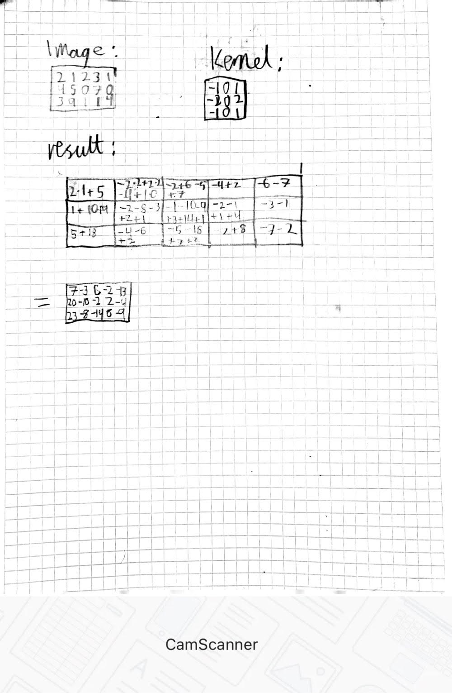
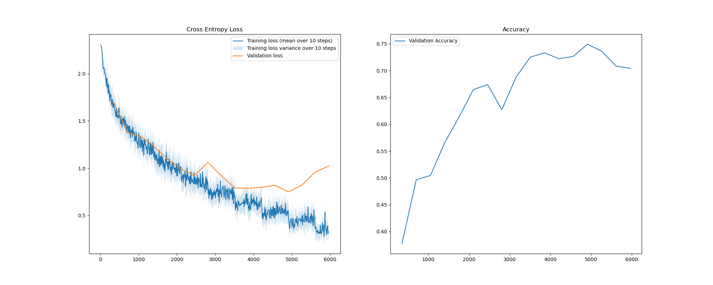

# TDT4265 Assignment 3
### Kasper Midttun Søreide

## Task 1
a)

b) 
Convolutional layer
  
c) 
padding of 3, because the convolution should be done on the edges.
  
d) 
5x5
  
e) 
254*254
  
f) 
For each convolutional layer, the number of parameters is: filter size * number of filters. So for just the convolutions we get: 
5*5*32 + 5*5*64 + 5*5*128 = 5600 
For the fully connected we have get the number of inputs * number of outputs + biases. The number of inputs for the fully connected layer is 4*4*128. So we get: 
4*4*128 * 64 + 64 = 2112 
So, in total we get 5600 + 2112 = 7712

## Task 2
Below is a plot of training, validation and test accuracy

## Task 3

## Task 4
When training stopped, these were the final results: 
Validation Loss: 0.33, Validation Accuracy: 0.902 
Figure showing validation and test loss during training: 

