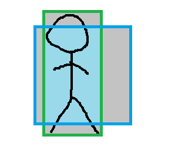
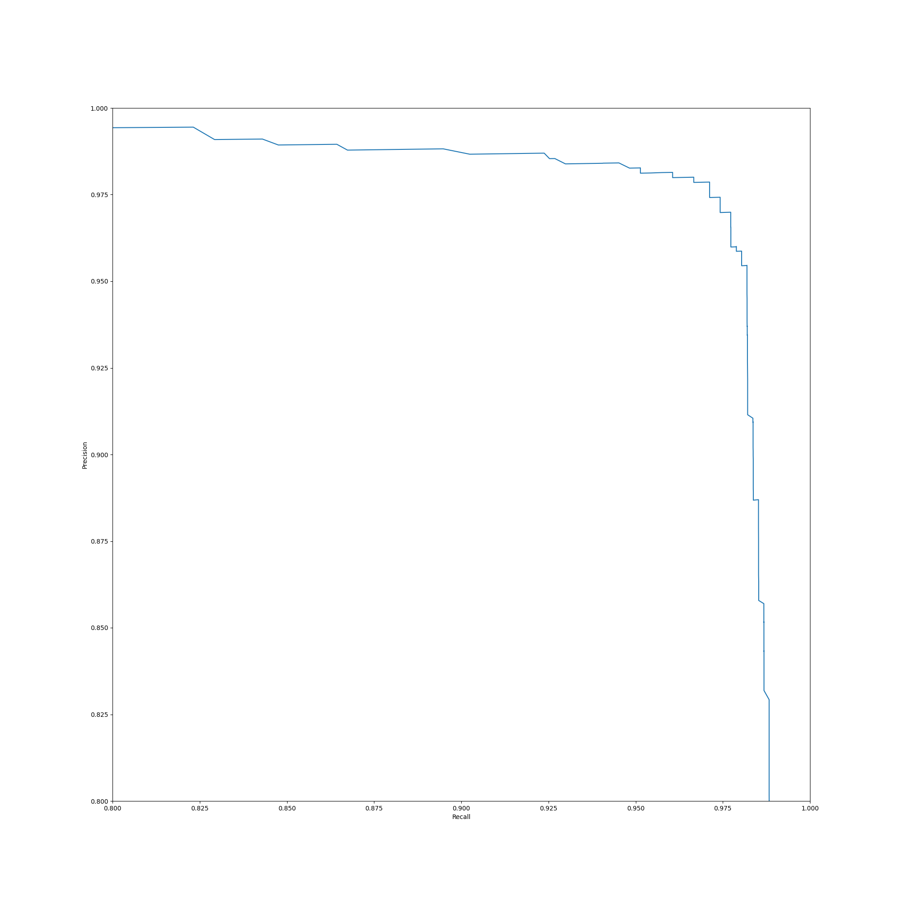

# TDT4265 Assignment 4
*Kasper Midttun Søreide*

## Task 1
a) 
IoU is short for Intersection over Union. It is the ratio between the intersection and the union of the guessed bounding box and the actual bounding box. In the figure below the green box is the actual bounding box and the blue one a guess. The intersection is the light blue area and the union is the gray area plus the light blue area.

  
b) 

$$Precision = {TP \over TP + FP} $$ 

$$Recall = {TP \over TP + FN} $$ 

TP stands for true positive, FP stands for false positive, and FN stands for false negative. A true positive is when a neural net recognizes an object and is correct. A false positive occurs when the NN recognizes an object that isn't present.

 
c) 

## Task 2
f) 

## Task 3
b) 
False. The deeper levels have lower resolution images, therefore recognizing bigger objects.
 

## Task 4